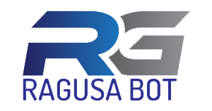

# Ragusa Bot | Your best news reporter of Ragusa


<p align="center">
  <a href="https://ragusabot.com">
    
  </a>
</p>

---

[](https://travis-ci.org/lasalefamine/ragusabot)
[](https://github.com/lasalefamine/ragusabot)
[](https://badge.fury.io/gh/LasaleFamine%2Fragusabot)
[](https://gemnasium.com/github.com/LasaleFamine/ragusabot)

> Built on top of [Bot Framework V3 (NodeJs)](https://github.com/Microsoft/BotBuilder)


**Ragusa Bot** is a **Facebook Messenger** and **Telegram** bot that lets you get when you want the latest news of the province of Ragusa.  
You can ask for the **daily news, politics, current events, sports, etc.** directly by sending a message on the Facebook page or through Telegram.  
Of course everything needs to be ask in italian :it: Try now!

<p align="center">
<a href="http://m.me/ragusabot">
  
</a>
<a href="https://telegram.me/ragusabot">
  
</a>
</p>


## Mission
Give opportunities to all citizens of the province of Ragusa to stay up-to-date and read local news quickly and easily directly on the smartphone.

## Develop

Built with the [Bot Framework V3]() and so written in NodeJs. I used the ES6 syntax so Node > 6 is required.

### Install

    $ git clone https://github.com/lasalefamine/ragusabot
    $ npm install

### Run in DEV mode

#### - [ngrok](https://ngrok.com/)

You can use [***ngrok***](https://ngrok.com/) to run in testing mode the application and make it available to the Microsoft Bot Builder service.  
If you are not familiar with the Bot Framework I have made a "learning" repository for it: [learning-ms-bot-builder](https://github.com/LasaleFamine/learning-ms-bot-builder)

> NOTE: don't forget to de-comment the `dotenv` require in the `config.js` file and create a `.env` file with the needed env variables:

src/config.js (require `dotenv`)
``` js
'use strict'

require('dotenv').config()
const builder = require('botbuilder')
const fastify = require('fastify')()

[...]
```
src/.env
```
GOOGLE_SHORTNER_KEY={KEY}
MICROSOFT_APP_ID={KEY}
MICROSOFT_APP_PASSWORD={KEY}
```
> The bot uses the [Google Apis Nodejs Client](https://github.com/google/google-api-nodejs-client) and [Google Shortner API](https://developers.google.com/url-shortener/v1/getting_started), so you need an ***API KEY*** to make a lot of requests, but the bot will work at the beginning also without the KEY.

#### - `ConsoleConnector`

If you want to try the bot directly inside the console you can simply modify the `config.js`:

``` js
'use strict'

// require('dotenv').config()
const builder = require('botbuilder')

//  =========================================================
//  Bot Setup
//  =========================================================

const connector = new builder.ConsoleConnector().listen()

const bot = new builder.UniversalBot(connector)

module.exports = {builder, bot}

```

> If you want you can use also here the Google API KEY for the Shortner API.

### Test

> Currently only [xo]()

    $ npm test

## License

[MIT](https://github.com/LasaleFamine/ragusabot/blob/master/LICENSE.md) &copy; LasaleFamine
